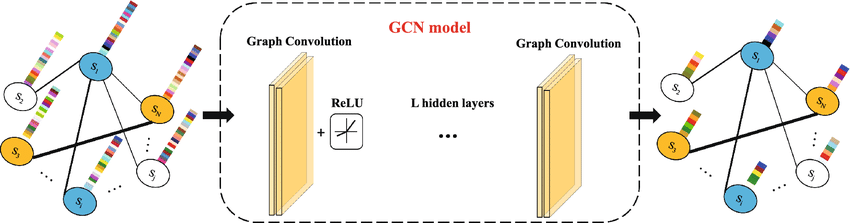
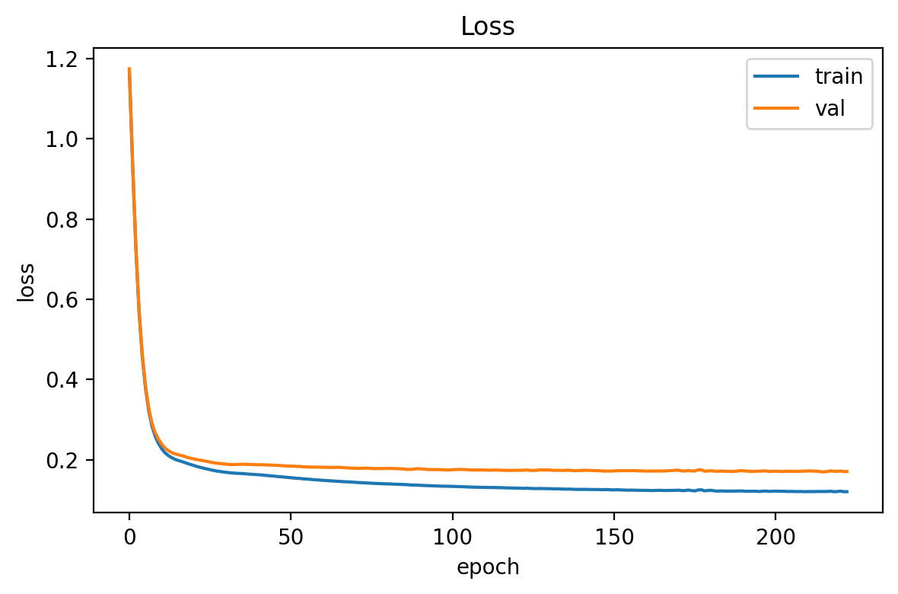
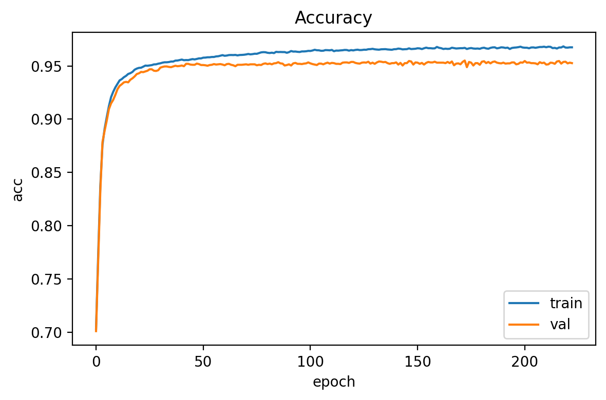
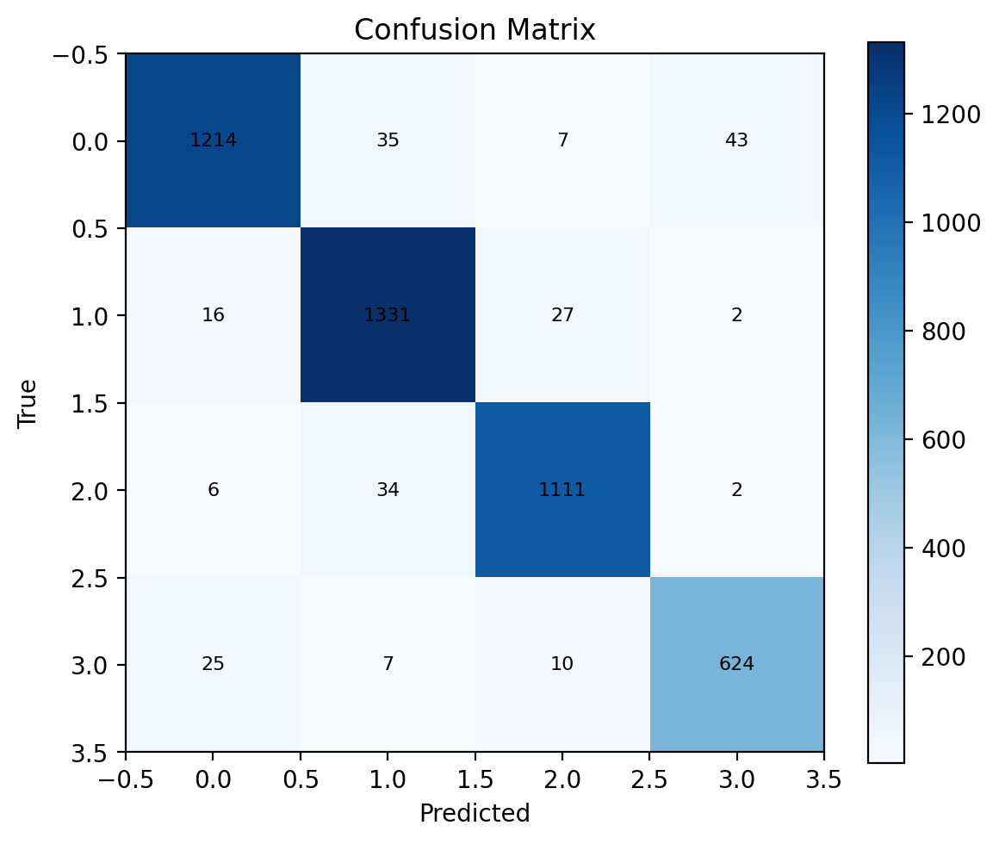
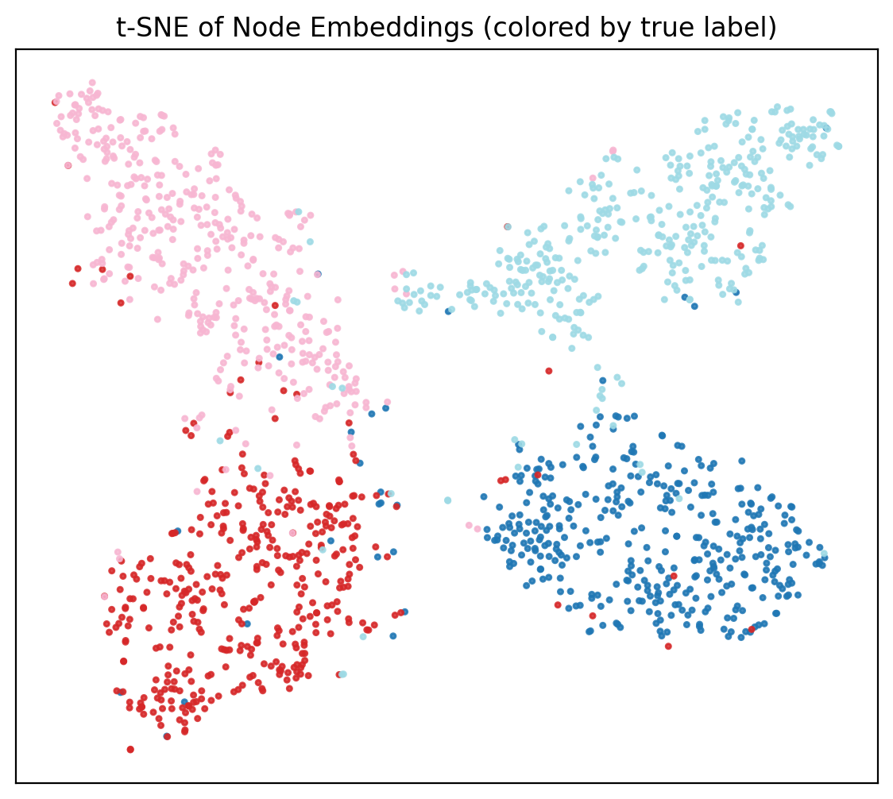

# Graph Neural Network on Facebook Large Page-Page Network  
**COMP3710 Pattern Analysis Project — Topic Recognition**

---

## 1. Project Overview
This project implements a two-layer Graph Convolutional Network (GCN) to perform semi-supervised multi-class node classification on the **Facebook Large Page-Page Network dataset**.  
The model learns to predict the category of Facebook pages (nodes) based on both their node features and network structure.

- **Task:** Semi-supervised node classification  
- **Dataset:** Facebook Large Page-Page Network (SNAP)  
- **Classes:** 4  
- **Difficulty Level:** Normal  
- **Language/Framework:** Python (PyTorch)

---

## 2. Dependencies
- python 3.11
- pytorch 2.4.1
- pytorch geometric 2.4
- matplotlib
- numpy
- scipy
- networkx

---

## 3. Files
- `dataset.py`: Contains the data loader for loading and preprocessing the Facebook Large Page-Page (FLPP) Network dataset.
- `modules.py`: Contains the source code for the GNN model components.
- `train.py`: Contains the source code for training, validating, testing and saving the model. The model is imported from “modules.py” and the data loader is imported from “dataset.py”. Losses and metrics are plotted during training.
- `predict.py`: Runs inference on the trained GNN classification model. Prints out results and provides visualisations of TSNE embeddings.
- `runner.sh`: (Optional) SLURM shell script for training model.
- `tests.py`: (Optional) Unit tests for python files.
- `gnn_classifier.csv`: (Optional) Output csv at each epoch of model training.

---

## 4. Dataset Description
| File | Description | Shape |
|------|--------------|-------|
| `feats.npy` | Node feature matrix | (22470, 4714) |
| `labels.npy` | Node labels (0–3) | (22470,) |
| `edge_index.npy` | Graph edges (source, target) | (2, 171002) |

- Each node represents a Facebook page.  
- Each edge indicates a mutual "like" relationship.  
- Semi-supervised splits: **60% train**, **20% val**, **20% test** (stratified).

---

## 5. Model Architecture

### Model Overview
The GCN model is a type of neural network designed to work with graph-structured data. Unlike CNNs that operate on grid-like data (such as images), GCNs work on graph data where each node aggregates information from its neighbors. The idea is that each node updates its feature representation by summing or averaging the features of its connected neighbors, allowing the model to capture the structural dependencies of the graph.

The general GCN process can be summarized as:
1. Each node receives input features and adjacency information.
2. These inputs are propagated through multiple graph convolution layers.
3. Each layer aggregates neighbor information and applies nonlinear activation (e.g., ReLU).
4. After several layers, node embeddings encode both their own features and the surrounding graph structure.


### Model Architecture Diagram
Below is the schematic diagram of the GCN model used in this project.



A **two-layer GCN** was implemented in `modules.py`:
```
Input → GCNConv(4714→128) → ReLU → Dropout(0.5) → GCNConv(128→4)
```
- Adjacency normalization: D^(-1/2)(A+I)D^(-1/2)
- Loss: CrossEntropyLoss
- Optimizer: Adam (lr=0.01, weight_decay=5e-4)
- Early stopping with patience = 50 epochs

---

## 6. Training Configuration
| Parameter | Value |
|------------|--------|
| Hidden units | 128 |
| Dropout | 0.5 |
| Learning rate | 0.01 |
| Weight decay | 5e-4 |
| Epochs | 1000 |
| Patience | 50 |

Run command:
```bash
python recognition/gnn-pagepage-s4806443/train.py \
  --data_dir recognition/gnn-pagepage-s4806443 \
  --device cpu
```

---

## 7. Evaluation
After training, the best model checkpoint (`best.pt`) was used for testing and visualization.

Run command:
```bash
python recognition/gnn-pagepage-s4806443/predict.py \
  --data_dir recognition/gnn-pagepage-s4806443 \
  --ckpt recognition/gnn-pagepage-s4806443/outputs/ckpts/best.pt \
  --device cpu
```

| Metric | Value |
|---------|--------|
| Test Accuracy | **0.9524** |
| Test Loss | **0.1770** |
| Macro-F1 | **0.9503** |
| Early Stopped | Epoch 223 |

---

## 8. Results and Visualizations
### • Training Curves
  


### • Confusion Matrix


### • t-SNE Visualization


---

## 9. Discussion
- The model achieved **>95% accuracy**, demonstrating effective feature propagation and class separation.  
- t-SNE embeddings show distinct clusters, confirming that GCN learned meaningful latent representations.  
- Misclassifications mainly occurred between visually similar or densely connected categories.  
- The early stopping mechanism prevented overfitting by monitoring validation accuracy with a patience of 50 epochs.
- Future improvements:
  - Experiment with GraphSAGE / GAT for inductive generalization.
  - Hyperparameter tuning (hidden size, dropout, learning rate).
  - Deeper GNN architectures or self-loop weighting.

---

## 10. File Structure
```
recognition/gnn-pagepage-s4806443/
├── dataset.py
├── modules.py
├── train.py
├── predict.py
├── figs/
│   ├── loss_curve.png
│   ├── acc_curve.png
│   ├── confusion_matrix.png
│   └── tsne.png
└── outputs/
    └── ckpts/
        └── best.pt
```

---

## 11. Usage Example and Reproduction Guide

This section provides a step-by-step guide to reproduce the results and visualize the model performance.

---

### Step 1: Prepare Dataset
Download and place the three required dataset files (`feats.npy`, `labels.npy`, `edge_index.npy`) in:
```
recognition/gnn-pagepage-s4806443/
```
These files correspond to node features, labels, and graph edges respectively.

---

### Step 2: Train the Model
To train the Graph Convolutional Network, run:
```bash
python recognition/gnn-pagepage-s4806443/train.py \
  --data_dir recognition/gnn-pagepage-s4806443 \
  --device cpu
```
This command will start training and automatically perform early stopping based on validation accuracy.

---

### Step 3: Evaluate and Generate Visualisations
After training, evaluate the model and generate visualisations using:
```bash
python recognition/gnn-pagepage-s4806443/predict.py \
  --data_dir recognition/gnn-pagepage-s4806443 \
  --ckpt recognition/gnn-pagepage-s4806443/outputs/ckpts/best.pt \
  --device cpu
```
This step produces:
- `figs/loss_curve.png` and `figs/acc_curve.png` — Training and validation performance  
- `figs/confusion_matrix.png` — Confusion matrix of classification results  
- `figs/tsne.png` — t-SNE embedding of node features

---

### Step 4: View Results
All results are saved automatically in:
```
recognition/gnn-pagepage-s4806443/
├── outputs/ckpts/best.pt
└── figs/
    ├── loss_curve.png
    ├── acc_curve.png
    ├── confusion_matrix.png
    └── tsne.png
```

You can open these images directly in VS Code or any image viewer to verify the output.

---

### Step 5: Export and Submit
Export the README as a PDF including all visualisations and submit it to Turnitin as required for the COMP3710 Pattern Analysis Project.

---

## 12. References
- Kipf, T. N., & Welling, M. (2017). *Semi-Supervised Classification with Graph Convolutional Networks.* ICLR.  
- SNAP Dataset: https://snap.stanford.edu/data/facebook-large-page-page-network.html

---